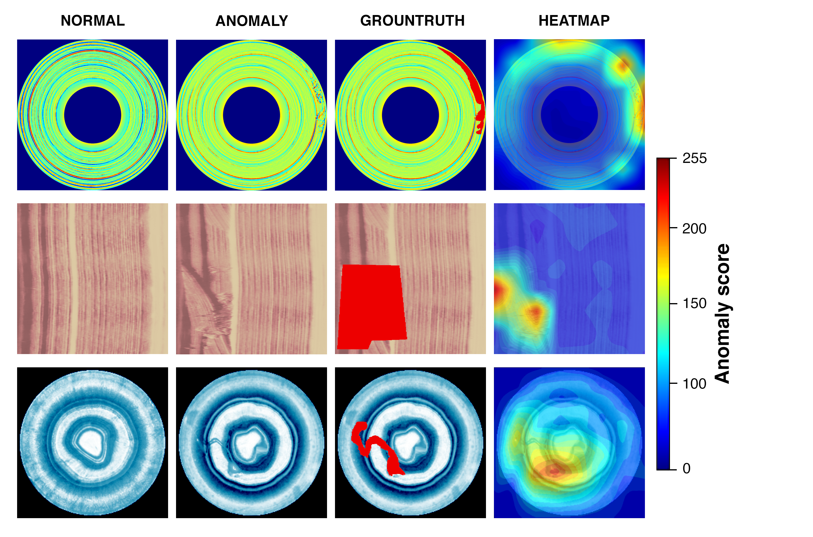
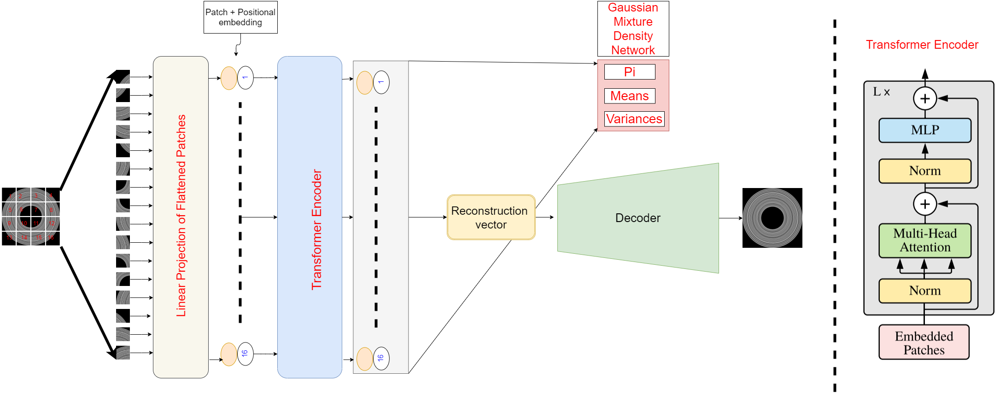
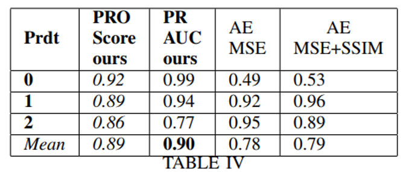
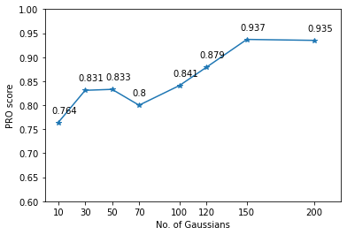

# VT-ADL : A Vision Transformer Network for Image Anomaly Detection and Localization
*Authors - Pankaj Mishra, Ricardo Verk, Daniele Fornasier, Claudio Piciarelli, Gian Luca Foresti*



**Abstract**- *We present a transformer-based image anomaly detection and localization network. Our proposed model is
a combination of a reconstruction-based approach and patch embedding. The use of transformer networks helps preserving
the spatial information of the embedded patches, which is later processed by a Gaussian mixture density network to localize the
anomalous areas. In addition, we also publish BTAD, a real-world industrial anomaly dataset. Our results are compared with other
state-of-the-art algorithms using publicly available datasets like MNIST and MVTec.*

# Network
The network is inspired from [Vision Transformer](https://openreview.net/pdf?id=YicbFdNTTy). It adapts the trasnformer network
for image anomaly detection and localization.


# Novel Dataset
Dataset contains RGB images of three industrial products – [Scan to download](https://avires.dimi.uniud.it/papers/btad/btad.zip)


* Product 1 :  Contains 400 images of 1600x1600 pixels
* Product 2 :  Contains 1000 images of 600x600 pixels
* Product 3 :  Contains 399 images of  800x600 pixels

# Results
* **MVTec Dataset** - *Real world anomaly dataset. contains 5354 high-resolution color and grey images of different texture and object categories.*


* **BTAD Dataset** - *Consists of high resolution 1.8K RGB images of industrial products.*


# Ablation
* *Choice of number of Gaussian’s in the mixture model is justified with increasing number of Gaussian’s.*
* *PRO Score first increases and then becomes constant*


## Regularization
* *Gaussian noise has been added to the encoded features from the transformer for regularization.* 
* *With Noise added the PRO score is 0.897 in contrary to 0.807 without noise.*

# Train (Command Line)
` python train.py -p "hazelnut" `

# Cite
If you use this dataset, please cite it using the following reference:
 
```
P. Mishra, R. Verk, D. Fornasier, C. Piciarelli, G.L. Foresti
"VT-ADL: A Vision Transformer Network for Image Anomaly Detection and Localization"
30th IEEE/IES International Symposium on Industrial Electronics (ISIE)
Kyoto, Japan, June 20-23, 2021
```

BibTeX:
```

@inproceedings{

        mishra21-vt-adl,
        author = {Mishra, Pankaj and Verk, Riccardo and Fornasier, Daniele and Piciarelli, Claudio and Foresti, Gian Luca},
        title = {{VT-ADL}: A Vision Transformer Network for Image Anomaly Detection and Localization},
        booktitle = {30th IEEE/IES International Symposium on Industrial Electronics (ISIE)},
        year = {2021},
        month = {June},
        location = {Kyoto, Japan}
	}
```
